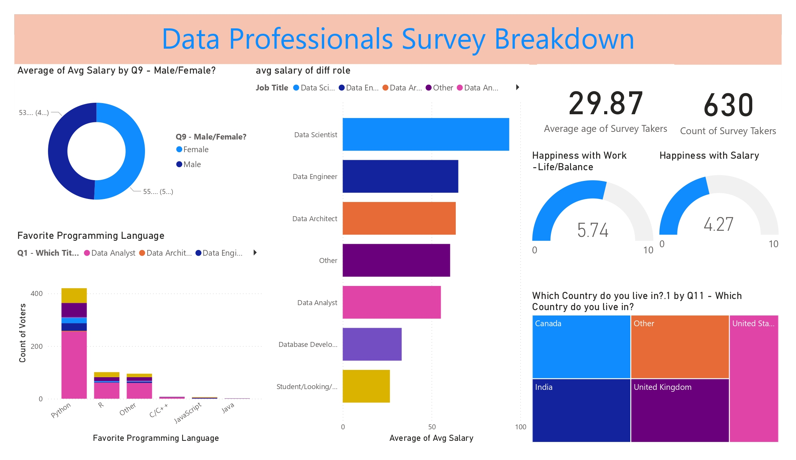

📊 Data Professionals Survey Dashboard
📌 Project Overview

This Power BI project analyzes survey data from data professionals across different roles, tools, and countries.
The dashboard provides insights into:

Demographics of professionals (roles, countries)

Average salary distribution by role and experience

Popular programming languages & tools

Work-life balance and satisfaction levels

The aim of this project is to visualize survey results in an interactive and insightful way for better understanding of the data industry landscape.

🛠 Tools & Technologies

Power BI Desktop (for data visualization)

Dataset: Data Professionals Survey (CSV/Excel)

DAX & Power Query for calculations and transformations

📈 Key Insights from Dashboard

Most respondents are Data Analysts and Data Scientists.

Python is the most widely used programming language.

Salary increases significantly with years of experience.

Work-life balance scores vary across roles and regions.

📂 Files Included

Data-Professionals-Survey-Dashboard.pbix → Power BI project file

Data-Professionals-Survey-Dashboard.pdf → Exported dashboard report for quick view

README.md → Project description

📷 Dashboard Preview

🚀 How to Use

Download the .pbix file.

Open with Power BI Desktop.

Explore different report pages and visuals.

🎯 Author

Developed by [Ch Prasad] | 📧 [chsurya2004@gmail.com] | 💼 [https://www.linkedin.com/in/suryachitturi/]
